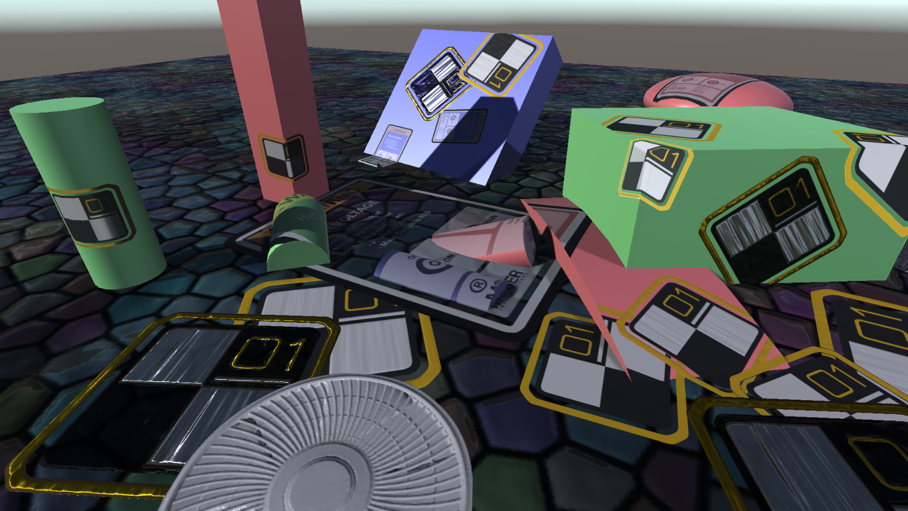
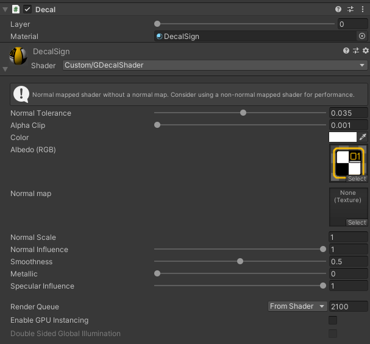
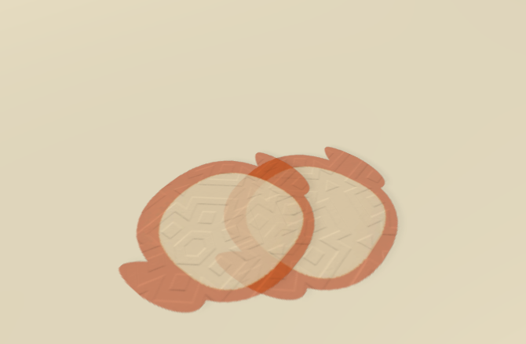
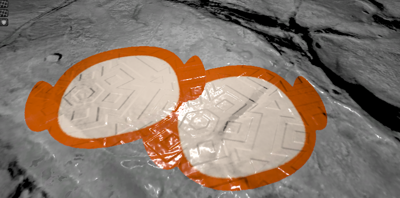

# UnityDeferredDecals
 Improved version of [unity's deferred decals system](https://docs.unity3d.com/Manual/GraphicsCommandBuffers.html) with support of layers and some basic frustum culling.

  

## How to use:
 0. Essential files are stored in `Assets/DeferredDecals`. You can copy paste this folder to your project and everything should work fine
 1. Add `DeferredDecalRenderer.cs` to your scene. There should be only one renderer
 2. Use `GameObject/Effects/Deferred Decal` to create decal
 4. Use `GDecalShader` shader for your decal material
 3. You're amazing :D

## Pros:
 * Improved inspector with embedded material editing:
 
 * Layers. Though making layers is **pretty expensive** since the more layers you have the more passes is needed.
 
 * Cutout. Each decal can use Alpha Clip to avoid using layers
 * Blending with background normals
 
 * Decals can influence smoothness
 * They are still rendered if you're inside the render box

 ## Cons:
 * No special normals/diffuse only decals, so each decal layer does copy 3 GBuffers no matter what
 * Visibility in editor can be clunky
 * Shader is under development. Specular color remains unchanged no matter what, no emission support
 * No instancing
 * Culling doesn't care about walls, it's just AABB check. For now
